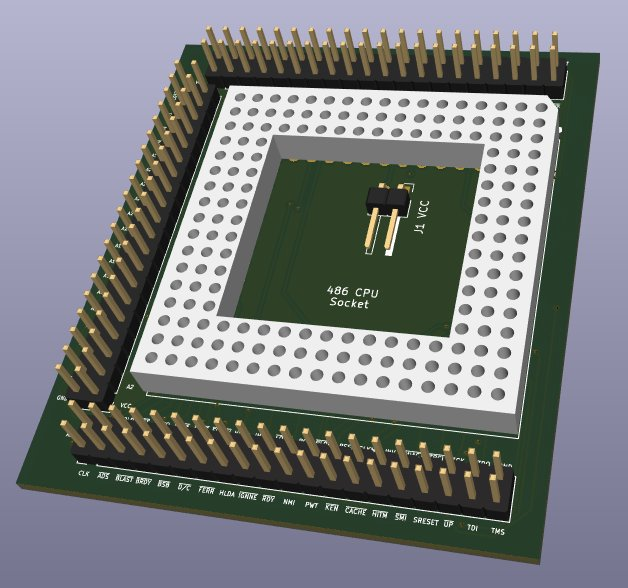
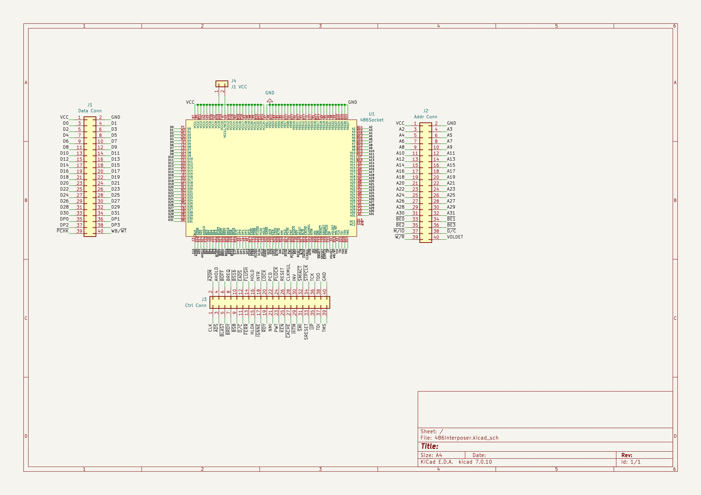
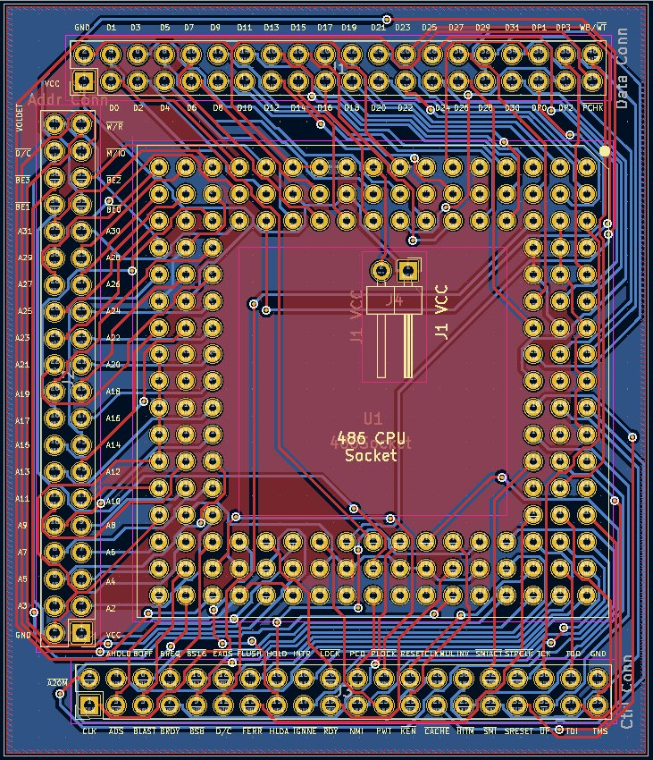
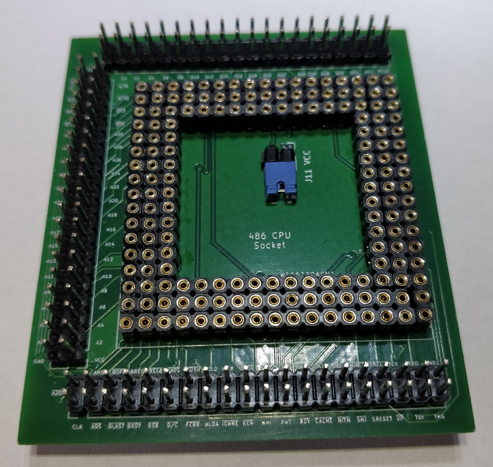
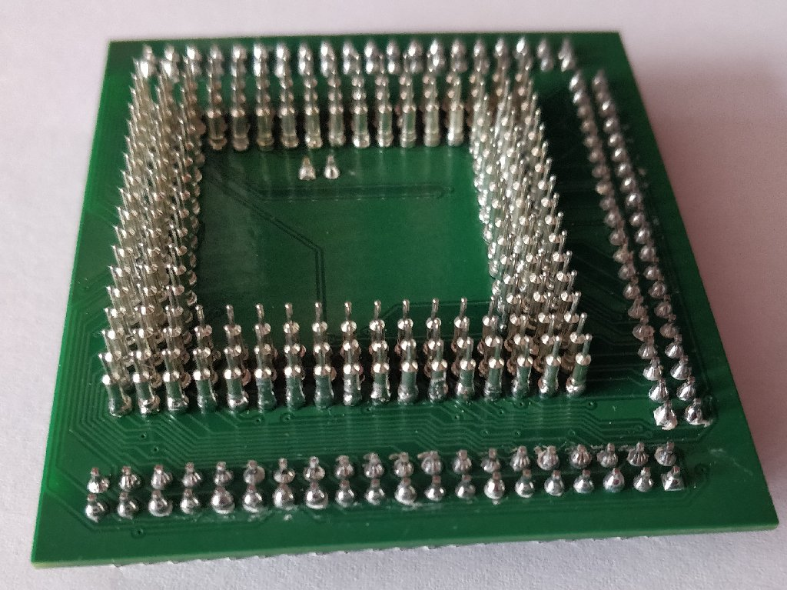
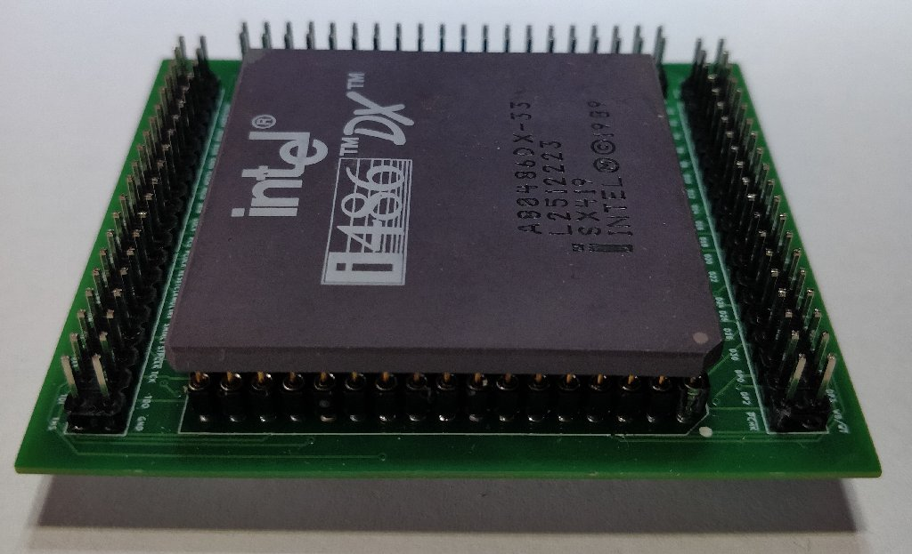

# Kicad-486-CPU-interposer
**486 Cpu Interposer**  
This interposer can be used to troubleshoot not working motherboards which have Socket3/PGA168 sockets.  
All i486 CPU signals are accesible on board connectors. It **should** be compatible with Intel/AMD 486DX/SX/DX2/DX4.  
On DX/SX and DX2 processors, J1 should be connected to VCC but on DX4 it may not be needed.  
The interposer was tested using an Intel 486DX processor.

## Requirements
[Kicad-486-CPU-socket](https://github.com/ciprian-stingu/Kicad-486-CPU-socket)

## PCB options:
* Material : FR-4, TG130 
* Layers : 2 
* Thickness : 1.0 mm

## Construction
Use round female pin header (1x40 pins, step 2.54mm) to construct the socket, starting from inside to the outside.  
After each row from top, solder to the undeside, pins extracted from round female pin header. Because the thickness of the board is only 1 mm, you will not have any problems soldering them on underside.

## Images

